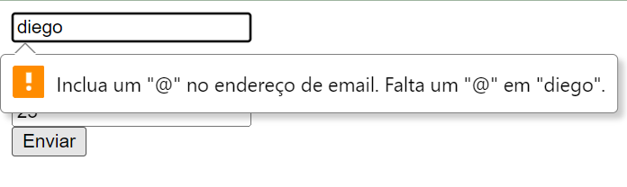

# Validação em Formularios

Este projeto implementa validações do input de um formulario do lado do Back-end com Node JS.

<br>

<div align="center">
  
</div>

<br>

## Sumário

- [Tecnologias Utilizadas](#tecnologias-utilizadas)
- [Status](#status)
- [Funcionalidades](#funcionalidades)
- [Explicação](#explicação)
- [Como Usar](#como-usar)
- [Autor](#autor)

<br>

## Tecnologias Utilizadas

<div style="display: flex; flex-direction: row;">
  <div style="margin-right: 20px; display: flex; justify-content: flex-start;">
    
  </div>
  <div style="margin-right: 20px; display: flex; justify-content: flex-start;">
    
  </div>
</div>

<br>

## Status


<br>

## Funcionalidades

Este projeto valida as entradas dos campos nome, email e senha em um formulário.

<br>

## Explicação

Temos a opção de fazer a validção com condicional:

```
 if (email == undefined || email == "") {
   emailError = "O e-mail não pode ser vazio";
  }
```
<br>

Ou utilizando a bibilioteca `validator`:

```
  if (!validator.isEmail(email)) {
    emailError = "E-mail inválido";
  }
```
<br>

## Como Usar

1. git clone `https://github.com/dgusfr/validation_Form_NodeJS`

2. npm install express --save

3. npm install body-parser --save

4. npm install express-session --save

5. npm install ejs --save

6. npm install express-flash --save

7. npm install nodemon -g

8. npm install cookie-parser


<br>

## Autor

Desenvolvido por Diego Franco
